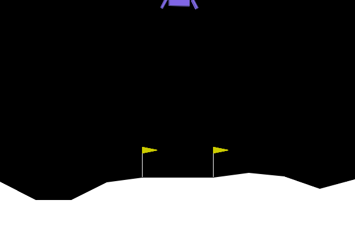
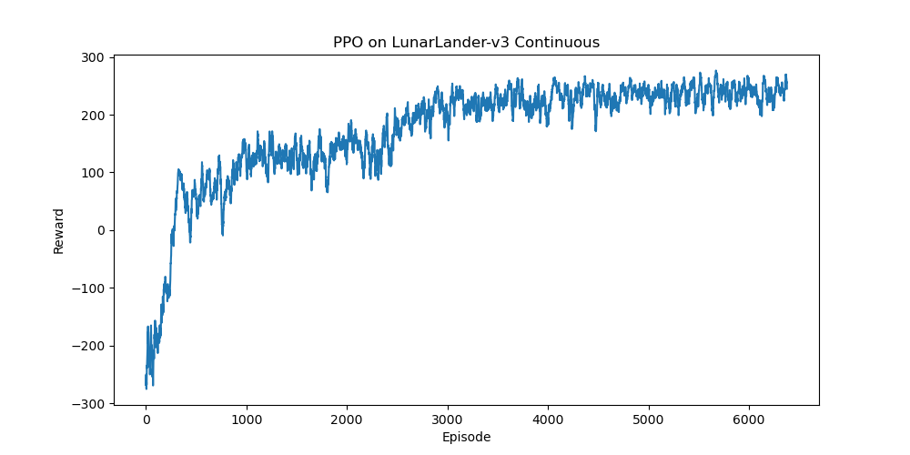

# PPO From Scratch

PPO (Proximal Policy Optimization) implemented from scratch in PyTorch. Trained to solve LunarLander-v3 with continuous control.

No external RL libraries (no Stable Baselines3, no ML-Agents). The entire algorithm, including actor-critic networks, trajectory collection, advantage estimation, and the clipped surrogate objective, is written from scratch.

## Demo



## Training Curve



## How It Works

PPO is a policy gradient algorithm that uses two neural networks:

- **Actor**: takes the current state and outputs a Gaussian distribution over continuous actions (main engine thrust and lateral engine thrust). Actions are sampled from this distribution during training, and the mean is used during evaluation.
- **Critic**: takes the current state and outputs a value estimate (how much total reward is expected from this state).

The training loop repeats: collect 2048 steps of experience, compute advantages (was each action better or worse than expected), then update both networks using the clipped surrogate objective. The clipping prevents the policy from changing too drastically in a single update.

Key implementation details:
- Generalized Advantage Estimation (GAE) with lambda = 0.95
- Entropy bonus to prevent premature convergence
- Gradient clipping for training stability
- Learning rate linear decay
- Action clamping for continuous control

## Results

| Metric | Value |
|--------|-------|
| Solved (avg reward > 200) | ~900 iterations |
| Final avg reward | ~259.4 |
| Training time | ~8 minutes |

## How to Run

```
pip install gymnasium torch numpy matplotlib imageio
python PPO.py
```

To watch the trained agent:

```
python Simulate.py
```

## Files

- `PPO.py` - training script with full PPO implementation
- `Simulate.py` - loads trained model, runs episodes, records gif
